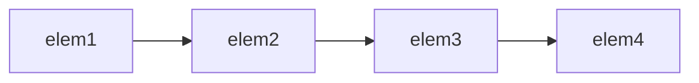
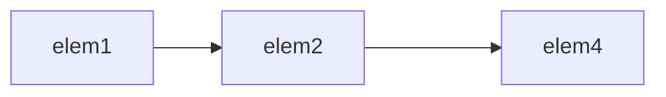

# 第九章 顺序容器

## 前言

本章是对第三章——字符串、向量和数组的扩展延伸，在第三章我们对标准库的顺序容器有一定了解，那么学习完本章我们对顺序容器的知识将会更加完整。

标准库定义了几种关联容器，关联容器中元素的位置由元素相关联的关键字值决定。我们将在本章对关联容器做一定了解，在第十一章将会介绍关联容器特有的操作。

在第三章我们就发现，顺序容器在操作上似乎有共通性，原因是在于容器类共享公共的接口，不同容器按照不同方式对其进行扩展。当然每种容器都提供不同的性能和功能的权衡。

容器可以看作一些特定类型对象的集合。**顺序容器**（sequential container)为用户（一般是程序员）提供控制元素存储和访问顺序的能力，根据元素加入容器的位置相对应。与之相对的关联容器，其依赖于元素的值，根据关键字的值来存储元素。

此外，标准库还提供三种容器适配器，分别为容器操作定义不同的接口，借此与容器类型进行适配。

---

## 9.1 顺序容器概述

在前言简述了顺序容器的概念，标准库中存在以下顺序容器：

|    顺序容器类型    |                      解释                      |
|:------------:|:--------------------------------------------:|
|    vector    |   可变大小数组。支持快速随机访问。在**尾部之外**的位置插入或删除元素可能很慢    |
|    array     |          固定大小数组。支持快速随机访问。不能添加或删除元素           |
|    string    | 与vector相似的容器，但专门用于保存字符。随机访问快。在**尾部**插入/删除速度快 |
|    deque     |       双端队列。支持快速随机访问。在**头尾位置**插入/删除速度很快       |
|     list     |   双向链表。只支持双向顺序访问。在list中任何位置进行插入/删除操作速度都很快    |
| forward_list |     单向链表。只支持单向顺序访问。在链表任何位置进行插入/删除操作速度都很快     |

> 从上述的解释中，我们不难发现顺序容器有着不同的性能折中。
>
> 例如：
>> 插入/删除元素较慢（以向容器添加或删除元素为代价）
>>
>> 无法进行快速随机访问（以非顺序访问容器元素为代价）

> 补充
>
> forward_list和array是C++11中新增加的类型。
>
>
forward_list在设计之初，其目的就是为了获得与最好的手写单向链表数据结构一致的性能，所以该类型并没有size操作，毕竟保存或计算其大小也会比手写链表多出额外开销:)。
>
> array类型与内置类型概念上一致，但是array更为安全、容易使用。当然，array对象大小是固定的，所以不支持添加和删除元素以及其他改变容器大小的操作。

虽然我们不愿承认大多数开发者设计的数据结构比标准库中容器运行速度慢，但事实便是如此:)。在C++下的标准库中容器的性能几乎与精心设计优化的同类数据结构一样好（通常更好😉）。

#### 确定使用哪种顺序容器

> 如无特殊要求，vector无疑是最好的选择。

顺序容器并不能依靠随性选择，而应该结合实际需求。当鱼与熊掌不可兼得时，我们必要时还需要通过测试性能获得最佳答案。

那么以下是一些选择顺序容器的基本原则：

- 在没有特殊/很好的理由下，vector是不二之选
- 如果程序中存在很多容量较小元素，同时空间的额外开销很重要。请不要选择list/forward_list
- 如果程序要求随机访问元素，则应该选择vector/deque
- 如果程序要求在容器中间插入/删除元素，则应该选择list/forward_list
- 如果程序需要头尾位置插入/删除元素，同时不会在中间位置插入/删除元素，则应该选择deque
- 如果程序只有在读取输入时，在输入阶段需要在容器中间位置插入元素，随后需要随机访问元素，那么
	- 首先，确定是否需要在容器中间位置插入元素。当处理数据时，通常很容易向vector追加数据，再通过调用sort函数重排容器中的元素，相对于直接在容器中间位置插入元素性能更优
	- 如果必须这样做，那么我们应该考虑在输入阶段使用list，在读取阶段将list中内容拷贝到vector中。

> 开发
>
> 在不确定使用何种容器的情况下，使用公共操作对容器进行操作绝对是最好的选择！例如，无法确定是使用vector还是list，我们应该避免使用下标，而应该使用迭代器操作。

## 9.2 容器库概览

容器类型上的操作形成了一种**层次**：

- 某些操作是所有容器类型都提供的
- 另外一些操作仅针对顺序容器、关联容器或无序容器
- 还有一些操作只适用于一小部分容器

一般来说，每个容器都定义在一个头文件中，文件名与类型名相同。容器均定义为模板类，所以我们必须提供额外信息来生成特定的容器类型。同时对大多数容器而言，我们还需要提供元素类型信息。

所有容器类型都提供的操作：

|            容器操作            |                解释                 |
|:--------------------------:|:---------------------------------:|
|            类型别名            |                                   |
|          iterator          |            此容器类型的迭代器类型            |
|       const_iterator       |       可以读取元素，但不能修改元素的迭代器类型        |
|         size_type          |    无符号整数类型，足够保存此种容器类型最大可能容器的大小    |
|      difference_type       |      带符号整数类型，足够保存两个迭代器之间的距离       |
|         value_type         |               元素类型                |
|         reference          |     元素的左值类型：与value_type&含有相同      |
|      const_reference       |           元素的const左值类型            |
|            构造函数            |                                   |
|            C c;            |       默认构造函数，构造空容器(array除外）       |
|         C c1(c2);          |             构造c2的拷贝c1             |
|         C c(b,e);          | 构造c，将迭代器b和e指定范围内的元素拷贝到c（array不支持） |
|       C c{a,b,c...};       |              列表初始化c               |
|          赋值与swap           |                                   |
|           c1=c2            |          将c1中的元素替换为c2中元素          |
|   <code>c1={a,b,c...}</code> |   将c1中的元素替换为列表中元素（ array不支持）     |
|         a.swap(b)          |             交换a和b的元素              |
|         swap(a,b)          |           与a.swap(b)等价            |
|             大小             |                                   |
|          c.size()          |      c中元素数目（forward_list不支持）      |
|        c.max_size()        |            c可保存的最大元素数目            |
|         c.empty()          |            判断c容器元素是否为空            |
|||
|  添加/删除元素（array不支持） <br/>   注：在不同容器中，这些操作的接口都不同|| 
|||
|       c.insert(args)       |           将args中元素拷贝进c            |
|      c.emplace(inits)      |         使用inits构造c中的一个元素          |
|       c.erase(args)        |            删除args指定的元素            |
|         c.clear()          |          删除c中所有元素，返回void          |
|           ==,!=            |            相等（不相等）运算符             |
|         <,<=,>,>=          |         关系运算符(无序关联容器不支持）          |               
|           获取迭代器            |                                   |
|     c.begin(),c.end()      |       返回指向c的首元素和尾元素之后位置的迭代器       |
|    c.cbegin(),c.cend()     |         返回const_iterator          |
| 反向容器的额外成员（forward_list不支持） |                                   |
|      reverse_iterator      |           按照逆序寻址元素的迭代器            |
|   const_reverse_iterator   |           不能修改元素的逆序迭代器            |
|    c.rbegin(),c.rend()     |       返回指向c的尾元素和首元素之前位置的迭代器       |
|   c.crbegin(),c.crend()    |     返回const_reverse_iterator      |

### 迭代器

与容器类似，迭代器同样存在公共接口。

|      运算符      |                        解释                        |
|:-------------:|:------------------------------------------------:|  
|    \*iter     |               返回迭代器iter所指元素的引用，解引用               |  
|  iter ->mem   |      解引用iter并获取该元素的名为mem的成员，等价于(\*item).mem      |  
|    ++iter     |                 令iter指示容器的下一个元素                  |  
|    --iter     |                 令iter指示容器中的上一个元素                 |  
| iter1\==iter2 | 判断两个迭代器是否相等，如果两个迭代器指示的是同一个元素或者它们是同一个容器的尾后迭代器，则相等 |  

> forward_list迭代器不支持递减运算符

**迭代器范围**（iterator range）由一对迭代器表示。两个迭代器分别指向**同一个**容器中的元素或者**尾元素之后**元素位置（one past the last element）[one piece :)]。从数学的角度我们可以认为该范围是**左闭合区间**（left-inclusive interval）。

那么，我们为什么要采用这种方式的迭代器范围呢？

好处有三：

- 如果begin和end相等，说明范围为空
- 如果二者不等，则范围至少包含一个元素，且begin指向该范围中的第一个元素
- 通过对begin的递增，可以使得begin=end

```cpp
/* value为可行值 */
while(begin!=end){
  *begin=value;
  ++begin;
}
```

从上例可以看出：在此循环之内都可以安全的解引用begin，begin必定指向一个元素，同时我们也能确定该循环最终必定会结束。

### 容器类型成员

在前面的章节中我们遇见过size_type、iterator和const_iterator三种类型。后两种类型都是迭代器类型，加上前面介绍的反向迭代器的reverse_iterator和const_reverse_iterator两种类型，我们现在总共认识五种容器类型。

上述类型均为类型别名。类型别名的作用是在不了解容器中元素类型的情况下使用它，比如，需要元素类型，可以使用value_type，如果需要元素类型的引用则可以使用reference或const_reference。这在泛型编程中很有作用。

例如：

```cpp
std::vector<int>::iterator it;
std::vector<int>::difference_type df;
```

### begin和end成员

begin和end存在多个版本，其中：

- 带r版本返回反向迭代器
- 带c版本返回const迭代器

当对const对象调用这些成员时，获得的是const版本迭代器。

比较常用的是将auto和begin与end结合，获得的迭代器依赖于容器类型（C++11支持），这样我们可以不用显式声明迭代器类型。

> 开发
>
> 在不需要进行访问操作时，应该使用cbegin和cend。

### 容器定义和初始化

每个容器类型都定义了一个默认构造函数。容器的默认构造函数都会创建一个指定类型的空容器，且都可以接受指定容器大小和元素初始值的参数（除了array之外）。

|             容器定义与初始化             |                  解释                   |
|:--------------------------------:|:-------------------------------------:|
|               C c                |                默认构造函数                 |      
|       C c1(c2)<br/>C c1=c2       | c1初始化为c2的拷贝，c1和c2必须相同类型、相同容器类型、相同元素类型 |
| C c{a,b,c...}<br/><code>C c={a,b,c...}</code> | c初始化为初始化列表中元素的拷贝。列表中元素类型必须与C的元素类型相容。  |
|             C c(b,e)             |      c初始化为迭代器b和e指定范围中的元素的**拷贝**。      |
|              C c(n)              | c中包含n个元素，这些元素均进行值初始化，且该构造函数为explicit  |
|            C seq(n,t)            |            c中包含n个初始值为t的元素             |

> 注意
>
> array容器是特殊的。
>
> 容器的默认构造函数中，如果容器为array则容器中元素按照默认方式初始化，否则该容器为空。
>
> 在进行两容器对象拷贝初始化时，array容器除了上述条件还需要保证二者必须具有**相同大小**。
> 同样，对容器对象进行列表初始化，列表中元素数目必须小于等于array的大小，对遗漏的元素进行值初始化。
>
> array容器无法通过迭代器指定范围中的元素进行拷贝，也无法仅指明元素大小的方式初始化容器。

那么，通过上面的列表，我们可以总结出：

- 将一个容器初始化为另一个容器的拷贝
	- 直接进行拷贝`C c1(c2)`，或者通过迭代器指定元素范围进行拷贝`C c1(it_begin,it_end)`。当然以上array容器均不可以使用😅
	- 需要注意的是：
		- **当直接通过一个容器的拷贝对另一个容器进行初始化时，两个容器的容器类型和元素类型必须相同**，但是如果选择通过传递迭代器参数的方式，则不需要容器类型相同，甚至不需要元素类型相同，只要拷贝的元素能够转换到被初始化的元素类型即可。
		  ```cpp
		  std::vector<std::string> v1{"hello","world","!"};
		  std::vector<const char*> word{"h","e","l","l","o","!"};
		  std::forward_list<std::string> v2{v1.cbegin(),v1.cend()};
		  /* const char*转换为string */
		  std::forward_list<std::string> v3{word.cbegin(),word.cend()};
		  ```
		- 既然可以使用迭代器参数来表示一个容器的元素范围，那么也就可以用来表示一个容器的子序列
		  ```cpp
		  /* it_1,it_2分别表示某个正确容器的某个迭代器，其指向正确元素且it_1<it_2 */
		  std::vector<int> total(it_1,it_2);      
		  ```
- 列表初始化
	- 当我们采用列表初始化的方式，实际上显式指定容器中每个元素的值并隐含指定了容器的大小。当然array除外🙃
- 与顺序容器相关的构造函数
	- 除了与关联容器相同的构造函数外，顺序容器（当然不包括array🫠）还提供另外一种构造函数。其会接受一个容器大小和一个（可选）元素初始值。如果不提供元素初始值，则默认会创建一个值初始化容器。
	  ```cpp
	  std::vector<int> v_1(10,1);
	  std::vector<int> v_2(10);
	  ```
	- 注意：
		- 如果元素类型是内置类型或者具有默认构造函数的类类型，则允许只为构造函数提供一个容器大小参数，但是如果元素类型并没有默认构造函数，那么除了提供容器大小参数外，还必须显式指定元素初始值。
		- 只有顺序容器的构造函数才接受大小参数，关联函数不支持
- array具有固定大小
	- 与内置数组一致，标准库array的大小也是类型的一部分。所以在定义array时必须指定元素类型和容器大小
	  ```cpp
		array<int,10>::iterator it; /* ok */
		array<int>::size_type i; /* error */    
	  ```
	  因此，在array并不支持普通的容器构造函数，这些构造函数都会确定容器的大小（无论是显式还是隐式）。同时在大多数情况下允许向一个array构造函数传递大小参数是错误的（也是多余的）。
	- 这种固定大小特性同样影响其构造函数的行为。
		- 默认构造的array容器应该是非空的（这点于普通容器不同），其内元素被默认初始化。
		- 在进行列表初始化时，初始值数目需要小于等于array大小。
		- 列表初始化随顺序依次初始化容器内元素，如果存在遗漏则进行值初始化。所以**当元素类型是类类型时，该类必须存在默认构造函数，否则值初始化不成功**
	- 对array进行拷贝和对象赋值
		- 在内置数组类型下是不允许进行拷贝或者对象赋值操作的，但是array不存在此限制。
		- 要求与其他容器一致，初始值的类型必须与要创建的容器类型相同、元素类型一致。但是还要求容器大小一致，毕竟容器大小也是array类型的一部分。

### 赋值和swap

在对容器的操作中，赋值运算符就是将左边容器中的全部元素替换成右边容器中元素的拷贝。

|           容器赋值运算            |                       解释                        |
|:---------------------------:|:-----------------------------------------------:|
|            c1=c2            |         将c1中的元素替换成c2中元素的拷贝。c1和c2类型必须相同          |
|        `c={a,b,c...}`         |         将c1中元素替换为初始化列表中元素的拷贝（array不支持）          |
| swap(c1,c2)<br/>c1.swap(c2) | 交换c1和c2中的元素。c1和c2必须具有相同的类型。swap通常比从c2向c1拷贝元素快得多 |
|        c.assign(a,b)        |     将c中元素替换为迭代器a和b所表示范围内的元素。迭代器a和b不能指向c中元素      |
|        c.assign(il)         |               将c中元素替换为初始化列表il中的元素               |
|        c.assign(n,t)        |                将c中元素替换为n个值为t的元素                 |

> 注意
>
> assign操作不支持关联容器和array😉。
>
> 赋值相关运算会导致指向左边容器内部的迭代器、引用和指针失效，但是swap操作例外（当然array和string容器除外）。

总结表格中的特殊点和注意点：

- 赋值运算左值和右值
	- 在`c1=c2`的格式下，赋值符号左右两边值的大小都将与右值大小一致
	- 在`c1={1,2,3}`的格式下，c1的大小将会与初始值列表的大小一致
- array容器
	- 和内置数组不一样的，array容器允许赋值，但是赋值符号左右两边的运算对象类型必须一致
	- 由于有运算对象的大小可能和左边对象不一致，所以array类型不支持assign，也不允许使用花括号包围的值列表进行赋值
	- 使用assign（仅顺序容器支持）
		- 赋值运算要求左右两边运算对象必须具有相同类型，那么顺序容器还提供另外一种方式，通过assign成员允许我们向那个不同但是相容的类型赋值。类似于seq成员之于容器初始化
		  ```cpp
			list<string> name;
			vector<const char*> oldstyle;
			name=oldstyle; /* error */
			name.assign(oldstyle.cbegin(),oldstyle.cend()); /* ok */
		  ```
		- 由于其旧元素被替换，所以**传递给assign的迭代器不能指向调用assign的容器**
		- 除了上述的方式外，assign还接受一个整数值和一个元素值
	    ```cpp
		list<string> name(1); /* 1个元素，为空string */    
		list<string> name.assign(10,"hi"); /* 10个元素，每个都是hi */
		```
- 使用swap
	- swap操作交换两个相同类型容器的内容。
    ```cpp
    vector<string> v1(10);
    vector<string> v2(20);
    swap(v1,v2); /* 交换元素，v1将会有20个元素，v2将会有10个元素 */    
    ```
	
	- > swap本质上交换的是两个容器内部数据结构，元素本身并未交换。
	  >
	  > 所以除了array之外，swap不会对任何元素进行拷贝、删除或者插入操作，因此可以保证在常数时间内完成。
	  那么就表示指向容器的迭代器、引用和指针在swap操作之后都不会失效，但是**在swap之后，已经属于不同的容器了**。
	  >
	  > 当然，array又是一个例外，swap操作对于两个array是真正交换对应元素。所以，交换两个array所需时间与array中元素数目成正比。

### 容器大小操作

每个容器类型都有三个与之大小相关的操作（存在一个例外，forward_list不支持size）。

- 成员函数size返回容器中元素的数目
- 成员函数empty返回当size等于0时布尔值为true，反之为false
- max_size返回一个大于等于该类型容器所能容纳的最大元素数值

### 关系运算符

每个容器类型都支持相等运算符（==和!=），除了无序关联容器外的所有容器都支持关系运算符（\>、\>=、\<、\<=）。当然关系运算符左右两方对象必须是相同类型容器，保存相同类型元素。

在前面我们介绍迭代器时就讲述过这些关系运算符的基本运行规则，下面详细描述一遍：

总体上遵守元素逐对比较，先判元素大小后判容器大小。

- 如果两个容器具有相同大小且所有元素都两两相等，则这两个容器相等；否则两个容器不等
- 如果两个容器大小不同，但较小容器中每个元素都等于较大容器中的对应元素，则较小容器小于较大容器
- 如果两个容器都不是另一个容器的前缀子序列，则它们的比较结果取决于第一个不相等元素的比较结果

例如：

```markdown
a1: 1,3,5,7,9,11
a2：1,3,6
a3：1,3,5,7
a4：1,3,5,7,9,11
a5：1,3,7

那么：
a1>a2，虽然a1[2]小于a2[2]，但是a1容量更大
a1>a3，a3相当于a1的子序列
a1=a4，二者逐个元素相等
a2<a5，二者在第三个元素比较上，a5第三个元素更大且二者容器大小一致
```

从上述我们不难看出**容器的关系运算符比较实际上是对元素的关系运算符比较**。

借此我们也会发现，仅元素类型支持关系运算符时，容器之间才能进行比较。

## 9.3 顺序容器操作

顺序容器和关联容器的不同之处在于两个组织元素的方式。

在上文我们了解了所有容器都支持的操作，下面将介绍顺序容器独有的操作。

### 向顺序容器添加元素

除了array外，所有标准库容器都提供灵活的内存管理。在运行时可以动态添加或者删除元素改变容器大小。

|                  添加元素操作                   |                                   解释                                   |
|:-----------------------------------------:|:----------------------------------------------------------------------:|
|  c.push_back(t)<br/>c.emplace_back(args)  |                    在c的尾部创建一个值为t或者由args创建的元素，返回void                     |
| c.push_front(t)<br/>c.emplace_front(args) |                    在c的头部创建一个值为t或者由args创建的元素，返回void                     |
|    c.insert(p,t)<br/>c.emplace(p,args)    |              在迭代器p指向的元素之前创建一个值为t或由args创建的元素，返回指向新添加元素的迭代器              |
|              c.insert(p,b,e)              | 将迭代器b和e指定范围内的元素插入到迭代器p指向元素之前，且b和e不能指向c中元素，返回指向新添加元素的第一个元素迭代器，若范围为空，返回p |
|               c.insert(p,i)               |     i为花括号包围的元素值列表。将给定元素添加到迭代器p所指向元素之前，返回指向新添加元素的第一个元素迭代器，若列表为空，返回p     |

> 注意
>
> 以上的操作均会改变容器自身大小，所以array容器不支持上述所有操作。
>
> forward_list有自己专用版本的insert和emplace，同时forward_list不支持push_back和emplace_back。
>
> vector和string不支持push_front和emplace_front。
>
> 最后，向一个vector、string和deque插入元素会使得所有指向容器的迭代器、引用和指针失效。

对上述的容器操作进行一个总结：

- 使用push_back
	- 其实在前面我们就已经使用过push_back操作了，实际上就是在某个容器尾部**追加**一个元素。（除了array和forward_list之外，每个顺序容器都支持push_back）。
		- 常规用法：
		    ```cpp
			container.push_back(word);
			```
		  `container`可以是string、list、vector或者deque，在container这个容器尾部创建一个`word`的拷贝元素，且容器size加一。
		  
		  关键点就在于**容器元素是拷贝**，类似于值传递。容器中的元素与提供值的对象没有任何关系，容器中元素的改变都不会影响原始对象，反之亦然。
- 使用push_front
	- 在对push_back支持的容器中，除了vector、string外，其他容器（list、forward_list和deque）还支持push_front操作，其操作是将元素插入到容器头部。
		- 常规用法：
		    ```cpp
			container.push_front(word);    
			```
		  其基本用法与push_back一致。
- 在容器的特定位置添加元素
	- 前面我们提到的push_front和push_back操作都是在容器的首尾添加元素，那么insert操作则是更为一般的执行添加功能。
	  
	  其允许在容器中任何位置添加0个或者多个元素。vector、list、deque和string都支持insert，其中forward_list提供特殊版本的insert操作。
		- 常规用法：
		  ```cpp
		  container.insert(iter,word);      
		  ```
		  insert函数接受一个迭代器作为其函数的第一个参数，该迭代器指出应该在那种位置放置新元素。其迭代器可以指向容器任何位置（包括尾部之后的下一个位置），同时由于迭代器可以指向不存在元素的位置，所以insert函数将元素插入到迭代器所指位置之前。
		  
		  insert函数可以将元素插入到容器的任何位置，但是需要注意的是这样可能会很耗时。

- 插入范围内元素
	- 除了支持上述的参数外，insert函数还可以接受一个元素数目和一个值，类似于对象初始化。
		- 常规用法：
		    ```cpp
			container.insert(iter,num,word);      
			```
		  insert函数将会将给定数目（num）的元素（word）添加到指定位置（iter）之前，这些元素都会依照定值初始化。
	- 除了接受给定数量的元素外，insert函数还接受一对迭代器和一个初始化列表。
		- 常规用法：
		    ```cpp
			container.insert(iter,iter_other_begin,iter_other_end);      
			container.insert(iter,{'word_1','word_2',...});
			```
		  注意：
			1. 无法传递一组指向添加元素的目标容器的迭代器。
			2. 在C++11标准下，接受元素个数或者范围的insert版本返回指向第一个新加入元素的迭代器，如果范围为空，不插入任何元素，insert操作会将以第一个参数返回。
- 使用insert的返回值
	- insert的返回值基本逻辑是：如果添加了新元素，则返回第一个新加入元素的迭代器，如果没有添加，则返回指定容器的迭代器（即第一个参数迭代器）。
	  
	  所以，我们可以通过使用insert的返回值，在容器中某个特定位置反复插入元素：
	    ```cpp
		list<string> list
		auto iter=list.cbegin();
		while(cin>>word)
			iter=list.insert(iter,word);    
		```
- 使用emplace操作
	- C++11标准中引入了三个新成员——emplace_front、emplace和emplace_back，分别与push_front、insert和push_back对应，区别是这些操作是构造而不是拷贝元素。
	  
	  当我们调用这三个成员函数时，其**直接将参数传递给元素类型的构造函数**，emplace成员使用这些参数在容器管理的内存空间中构造元素。
	  
	  例如：
	  ```cpp
	  /* 假定c保存Sales_data元素 */
	  
	  /* 在c尾部添加Sales_data元素 */
	  c.emplace_back("abc",25,19); /* 正确，直接将三个参数传递给Sales_data构造函数，再将Sales_data元素创建在c的尾部 */ 
	  c.push_back("abc",25,19); /* 错误，没有接受这三个参数的push_back版本 */
	  c.push_back(Sales_data("abc",25,19)); /* 正确，构造临时Sales_data对象 */
	  ```
	  
	  对比第一种和最后一种构建方式就可明白emplace_back的操作，当调用emplace_back时，会在容器管理的内存空间中直接创建对象，而使用push_back方式则是创建临时对象，再将临时对象拷贝。
	  
	  > 注意
	  >
	  > emplace函数在容器中直接构造元素，那么传递给emplace函数的参数必须与元素类型的构造函数相匹配。

### 访问元素

既然我们可以向容器中添加元素，自然就可以从容器中访问元素的操作。

| 顺序容器中访问元素操作 |                       解释                       |
|:-----------:|:----------------------------------------------:|
|  c.back()   |            返回c中尾元素的引用。若c为空，函数行为未定义             |
|  c.front()  |            返回c中首元素的引用。若c为空，函数行为未定义             |
|    c[n]     | 返回c中下标为n的元素的引用，n是一个无符号整数。若n>=c.size()，则函数行为未定义 |
|   c.at(n)   |   返回下标为n的元素的引用。如果下标越界，则抛出一个“out_of_range”异常    |

> 注意
>
> at和下标操作只适用于string、vector、deque和array。back不适用于forward_list。
>
> 对一个空容器调用front和back是一种严重的程序设计错误。

由于访问成员函数返回的是引用，且如果容器是const，则返回const引用。所以我们可以通返回的引用修改容器中元素值。

安全使用下标操作实现随机访问。提供快速随机访问的容器（string、vector、deque和array）都会提供下标运算符。但是我们必须保证下标的合理有效性，下标运算符不会检查下标是否在合法范围，同时编译器也不会检查这种错误。

如果希望下标合法，可以使用at成员函数，如果下标越界，at将会抛出一个out_of_range异常。

### 删除元素

和添加元素方法类似，容器也存在多种删除元素的方式。（当然array除外😅）

|   顺序容器的删除操作   |                                解释                                |
|:-------------:|:----------------------------------------------------------------:|
| c.pop_back()  |                  删除c中尾元素。若c为空，则函数行为未定义。函数返回void                  |
| c.pop_front() |                  删除c中首元素。若c为空，则函数行为未定义。函数返回void                  |
|  c.erase(p)   | 删除迭代器p所指元素，返回一个指向被删元素之后元素的迭代器，若p指向尾元素，则返回尾后迭代器。若p是尾后迭代器，则函数行为未定义 |
| c.erase(b,e)  | 删除迭代器b和e所指定范围内的元素。返回一个指向最后一个被删元素之后元素的迭代器，若e本身就是尾后迭代器，则函数也返回尾后迭代器 |
|   c.clear()   |                         删除c中所有元素。返回void                          |

> 注意
>
> 由于这些操作会改变容器大小，所以array不支持上述操作。
>
> 与insert和emplace一样，forward_list有自己特殊版本的erase，且forward_list不支持pop_back；vector和string不支持pop_front。
>
> 删除deque中除首尾位置之外的任何元素都会使得所有迭代器、引用和指针失效。指向vector和string中删除点之后位置的迭代器、引用和指针都会失效。
>
> 删除元素的成员函数并不会检查其参数，所以在删除前，请务必确保参数是正确的。

- pop_front和pop_back成员函数
	- pop_front和pop_back成员函数分别删除首元素和尾元素。
	  
	  与vector和string不支持push_front类似，这两个容器也不支持pop_front。同样与forward_list不支持push_back类似，该容器也不支持pop_back。
	  
	  与元素访问成员函数类似，不能对一个空容器执行弹出操作。
- 从容器内部删除元素
	- 成员函数erase从容器中指定位置删除元素，既可以删除一个迭代器指定的单个元素，也可以删除由一对迭代器指定范围内的所有元素。这两种形式的erase都返回指向删除的（最后一个）元素之后位置的迭代器。
	- 除了通过一组迭代器方式删除指定范围元素，也可以调用clear函数删除容器中所有元素。

### 特殊的forward_list操作

forward_list容器是由单链表组成的，所以其对容器的操作与其他容器（vector、list、deque等）不同，所以C++专门定义了其特殊版本的forward_list操作。

<div style="text-align: center;">



</div>
当删除elem3会改变elem2的值
<div style="text-align: center;">



</div>

单链表中对元素的增删下，假设我们删除elem3
其元素之前的元素（elem4）的后继将会改变，同时其元素之前的元素（elem2）的前驱也会发生改变。这就导致我们没有简单的方式来获取一个元素的前驱，所以在forward_list中添加或者删除元素实质上是通过改变给定元素之后的元素（elem2）来完成的。

所以这就是forward_list的特殊之处，其操作的实现方式与其他容器的不同导致该容器并没有定义insert、emplace和erase，而是对应定义的insert_after、emplace_after和erase_after。

|                                      forward_list插入或删除元素操作                                      |                                                           解释                                                            |
|:-----------------------------------------------------------------------------------------------:|:-----------------------------------------------------------------------------------------------------------------------:|
|                             c.before_begin()<br/>c.cbefore_begin()                              |                                          返回指向链表首元素之前不存在的元素的迭代器。**此迭代器不能解引用**。                                           |
| c.insert_after(p,t)<br/>c.insert_after(p,n,t)<br/>c.insert_after(p,b,e)<br/>c.insert_after(p,i) | 在迭代器p**之后的位置**插入元素。<br/>t表示对象，n表示数量，b和e表示一组迭代器（其不能指向c内元素），i表示一个花括号列表。<br/>返回一个指向最后一个插入元素的迭代器。如果范围为空则返回p。若p为尾后迭代器，则函数未定义 |
|                                  emplace_after(p,<i>args</i>)                                   |                               使用<i>args</i>在p指定位置之后创建一个元素。返回指向这个新元素的迭代器。若p为尾后迭代器，则函数行为未定义                               | 
|                            c.erase_after(p)  <br/>c.erase_after(p,e)                            |                删除p指向的位置之后的元素，或删除从p到e之间的元素。返回一个指向被删除元素之后元素的迭代器，若不存在则返回尾后迭代器。如果p指向c的尾元素或者是一个尾后迭代器，则函数行为未定义                |

在处理forward_list中增删元素时，我们需要关注两个迭代器——一个指向我们要处理的元素，另一个指向其前驱。

例如：

```cpp
/* 删除forward_list容器中的奇数 */
std::forward_list<int> list{0, 1, 2, 3, 4, 5, 6, 7, 8, 9};
auto                   prev = list.before_begin(); /* this is previous node */
auto                   curr = list.begin(); /* this is current node */
while (curr != list.end()) {
    if (*curr % 2) {
        curr = list.erase_after(prev); /* update current node */
    } else {
        prev = curr; /* move previous node */
        ++curr; /* move current node */
    }
}
```

### 改变容器大小

C++提供resize函数用于修改容器的大小（当然，这其中不包括array），如果当前容器大小大于所要求大小，则容器后部的元素会被删除；如果容器大小小于要求大小，则新元素（默认初始化）将会添加在容器尾部。

|   顺序容器大小操作    |          解释           |
|:-------------:|:---------------------:|
|  c.resize(n)  |  调整c的大小，将其修改为存储n个元素   |
| c.resize(n,t) | 调整c的大小，其添加的元素将会被初始化为t |

例如：

```cpp
list<int> list(10,2);
list.resize(15); /* 在list末尾添加5个新元素，其值为0，c大小为15*/
list.resize(20,3); /* 在list末尾添加5个新元素，其值为3，c大小为20 */
list.resize(10); /* 删除list后部10个元素，c大小为10，所有元素值为2 */
```

### 容器操作可能使迭代器失效

对容器的操作可能会导致指向容器元素的指针、引用或者迭代器失效，这会引发严重的程序设计错误，同时很可能引起与未初始化指针一样的问题。

- 向容器中添加元素
	- 如果容器vector或者string,且存储空间被重新分配，则指向容器的迭代器、指针和引用都会失效。如果存储空间未重新分配，指向插入位置之前的元素的迭代器、指针和引用仍然有效，但是指向插入位置之后元素的迭代器、指针和引用会失效
	- 对于deque,插入到除了首尾位置之外的任何位置都会导致迭代器、指针和引用失效。如果在首尾位置添加元素，迭代器会失效，但是指向存在的元素的引用和指针不会失效
	- 对于list和forward_list，指向容器的迭代器（包括尾后迭代器和首前迭代器）、指针和引用仍然有效
- 向容器删除一个元素
	- 对于list和forward_list,指向容器其他位置的迭代器（包括尾后迭代器和首前迭代器）、引用和指针仍然有效
	- 对于deque,如果在首尾之外的任何位置删除元素，那么指向其他元素的迭代器、引用或指针也会失效。如果是删除deque的尾元素，则尾后迭代器也会失效，但是其他迭代器、引用和指针不受影响；如果删除首元素，上述也不受影响
	- 对于vector和string,指向被删除之前元素的迭代器、引用和指针仍然有效

> 开发
>
> 管理迭代器
>
> 当使用迭代器（指向容器元素的指针或者引用）时，最小化要求迭代器必须保持有效的程序片段是一个好的方法。

- 编写改变容器的循环程序
	- 对于可能出现的指向失效问题，在循环程序中必须保证其指向的可靠。如果循环中使用insert或者erase， 那么我们可以借用其**函数返回迭代器**的方式来更新迭代器
- 不要保存end返回的迭代器
	- 当我们添加/删除vector或者string的元素后，或者deque中首元素之外任何位置添加/删除元素后，原来end返回的迭代器**总是会失效**
	- 如果在一个循环中插入/删除deque、string或者vector中的元素，**不要缓存end返回的迭代器**

## 9.4 vector对象是如何增长的

vector容器本身支持快速随机访问。为了支持这一特性，那么vector容器将元素连续存储。同时vector又支持容器大小可变，那么如果容器需要新增元素，不可能在容器尾后随意新建连续空间，vector容器必须新建一个空间，并将原本元素和新元素添加入新内存空间。但是如果每次新增一个元素就需要移动内存空间，对于性能要求是不可接受的。

在此基础上，C++标准库开发者设计了可以减少容器空间重新分配次数的策略。在创建vector和string上实际的内存空间比需求空间更大。预留的空间用于备用，以此可以保留更多元素。

那么这里就存在管理内存容器的操作了，所以vector和string提供一些成员函数，其允许我们对容器实现中内存分配部分互动。

|     容器大小管理操作      |            解释            |
|:-----------------:|:------------------------:|
|   c.capacity()    | 不重新分配内存空间的情况下，c可以保存多少元素  |
| c.shrink_to_fit() | 将capacity()减少与size()相同大小 |
|   c.reserve(n)    |     分配至少能容纳n个元素的内存空间     |

> 注意
>
> shrink_to_fit仅支持vector、string和deque容器，capacity和reserve仅支持vector和string容器。
> reserve并不会改变容器中元素的数量，仅影响vector预先分配多大的内存空间。（注意一个是元素数量，一个是容器内存空间大小）

在实际对容器大小管理上，总结来讲：只有当需要的内存空间超过当前容量时，reserve调用才会改变vector的容量，如果需求大小大于当前容量，reserve至少分配与需求一样大的内存空间（可能更大）。

具体来讲：

- 如果需求大小小于或者等于当前容量，reserve什么也不会做。
	- 特别的，当需求大小小于当前容量时，容器不会退回内存空间。所以，在调用reserve之后，capacity将会大于或者等于传递给reserve的参数。
	- 调用reserve永远不会减少容器占用的内存空间。
- C++11下，通过shrink_to_fit函数可以溢出多余的内存空间，但是具体实现下这是可以忽略的，也就是说调用该函数不一定退回内存空间。

在前面我们就提到size和capacity是两个不同的概念，size用于指代容器中已经保存的元素数量，而capacity用于指代容器中在不分配新内存空间下最多可以保存的元素（也就是说，capacity数量=size数量+预留数量）。

例如：

```cpp
int main() {
    std::vector<int> vector;

    std::cout << "the size is: " << vector.size() << ",and the capacity is: " << vector.capacity() << "\n";

    for (std::vector<int>::size_type i = 0; i != 10; ++i) {
        vector.push_back(i);
    }

    std::cout << "now,the size is: " << vector.size() << ",and the capacity is: " << vector.capacity() << "\n";
}
```

其结果为：

```markdown
the size is: 0,and the capacity is: 0
now,the size is: 10,and the capacity is: 16
```

从上述结果可以看出，标准库会根据其具体实现为容器多分配一些内存空间。当需求数量超过capacity数量时，那么就必须为vector分配新空间，且**标准库实现策略是将新分配空间的大小设置为原空间的两倍**。

> 从某种意义上来讲，当我们存储大量数据于vector时，该标准库实现策略是显得不够“聪明”的，因为这样可能会浪费内存资源，但是相较于重新分配空间，这样又显得合理。
>
> 我们可以为每个vector实现选择自己的内存分配策略，但是需要注意：只有在迫不得已的情况下才分配新的内存空间。

## 9.5 额外的string操作

额外的string操作大部分是针对string类和C风格字符数组之间的相互转换和允许使用下标替代迭代器。

### 构造string的其他方法

除了在3.2.1节已经了解过的构造方式，以及与其他顺序容器相同的构造方式，string还有：

|       构造string方式       |                                               解释                                                |
|:----------------------:|:-----------------------------------------------------------------------------------------------:|
|     string s(cp,n)     |                                s是cp指向的数组中n个字符的拷贝，cp指向数组至少包含n个字符                                 |
|   string s(s2,pos2)    |                      s是string s2从下标pos2开始的字符的拷贝，若pos2>s2.size()，构造函数的行为未定义                      |
| string s(s2,pos2,len2) | s是string s2从下标pos2开始len2个字符的拷贝。若pos2>s2.size()，构造函数行为未定义。不管len2的值是多少，构造函数至多拷贝s2.size()-pos2个字符。 |

示例：

```cpp
int main() {
    const char*c ="hello world!";
    char cl[]={'h','e','l','l','o'};
    std::string s1(c); /* hello world! */
    std::string s2(cl,2); /* he */
    std::string s3(c,5); /* hello */
    std::string s4(c,5,6); /*  world */
    std::string s5(cl); /* 未定义 */
    std::string s6(c,16); /* abnormal: out_of_range */
}
```

> 注意
>
> C风格字符是在文本末尾添加一个空格作为结尾，所以指针指向的数组（cl）必须以空字符结尾，这样拷贝操作才能在遇到空字符时停止。
>
> 存在这种情况，如果我们传递给构造函数一个计数值，那么数组就可以不用空字符结尾。但是，如果我们没有传递计数值且数组也没有以空字符结尾，或者给定计数值大于数组大小，则该构造函数行为未定义。

substr操作用于返回一个string，其为原本string的一部分或者全部的拷贝，可以通过传递一个开始位置和计数值获得。

|     子字符串操作      |                          解释                           |
|:---------------:|:-----------------------------------------------------:|
| s.substr(pos,n) | 返回一个string,包含s中从pos开始的n个字符的拷贝。pos默认0,n默认s.size()-pos。 |

示例：

```cpp
std::string str{“hello world!"};
std::string substr=str.substr(0,5); /* hello */
```

> 如果开始位置超过string大小，抛出out_of_range。如果开始位置加上计数值大于string大小，则substr函数会调整计数值，让其只能拷贝到string的末尾。

### 改变string的其他方法

总结来说：

|             修改string的操作             |                                       解释                                        |
|:-----------------------------------:|:-------------------------------------------------------------------------------:|
|  s.insert(<i>pos</i>,<i>args</i>)   | 在pos**之前**插入args指定的字符。pos可以是一个下标或者迭代器。接受下标的版本返回一个指向s的引用；接受迭代器的版本返回指向第一个插入字符的迭代器 |
|   s.erase(<i>pos</i>,<i>len</i>)    |          删除**从**位置pos开始的len个字符。如果len被省略，则删除从pos开始直至s末尾的所有字符。返回一个指向s的引用          |
|        s.assign(<i>args</i>)        |                          将s中的字符替换为args指定的字符。返回一个指向s的引用                          |
|        s.append(<i>args</i>)        |                              将args追加到s.返回一个指向s的引用                               |
| s.replace(<i>range</i>,<i>args</i>) |       删除s中范围range内的字符，替换为args指定的字符。range可以是一个下标和一个长度，或者是一对迭代器。返回一个指向s的引用        |

> args可以是下列形式之一，append和assign可以使用下列所有形式。
>
> str不能与s相同，迭代器b和e不能指向s。
>
> |     形式      |           解释           |
> |:-----------:|:----------------------:|
> |     str     |          字符串           |
> | str,pos,len |   str中从pos开始最多len个字    |
> |   cp,len    | 从cp指向的字符数组的前（最多）len个字符 |
> |     cp      |    cp指向的以空字符结尾的字符数组    |
> |     n,c     |         n个字符c          |
> |     b,e     |    迭代器b和e指定的范围内的字符     |
> |    初始化列表    |   花括号包围的，以逗号分隔的字符列表    |
>
> replace和insert所允许的args形式依赖于range和pos是如何指定的。
>
> |     replace     |  replace   |   insert   |   insert    |   args可以是   |
> |:---------------:|:----------:|:----------:|:-----------:|:-----------:|
> | (pos,len,args)  | (b,e,args) | (pos,args) | (iter,args) |             |
> |        是        |     是      |     是      |      否      |     str     |
> |        是        |     否      |     是      |      否      | str,pos,len |
> |        是        |     是      |     是      |      否      |   cp,len    |
> |        是        |     是      |     否      |      否      |     cp      |
> |        是        |     是      |     是      |      是      |     n,c     |
> |        否        |     是      |     否      |      是      |    b2,e2    |
> |        否        |     是      |     否      |      是      |    初始化列表    |


string类型除了常规的操作外，还定义了额外的insert和erase版本。

string支持接受下标版本：

```cpp
s.insert(s.size(),5,'!'); /* 在s末尾插入5个！*/
s.erase(s.size()-5,5); /* 从s末尾倒数删除5个字符 */
```

当然也接受C风格字符数组：

```cpp
const char *cp="hello";
s.assign(cp,2); /* he */
s.insert(s.size(),cp+2); /* hello */
```

同时可以插入其他string：

```cpp
string s1="some string",s2="some other string";
s.insert(0,s2); /* 在s[0]之前插入s2的拷贝 */
s.insert(0,s2,0,s2.size()); /* 在s[0]之前插入s2[0]开始的s2.size()个字符 */
```

结果：

```markdown
some other string
some other stringsome other string 
```

总的来说，参数一为目标string下标开头，参数二为内容string开头，在目标string前插入string。

#### append和replace函数

append函数是在string末尾进行插入操作的简写方式。

常规在string末尾插入string，使用：`s.insert(s.size,"this");`，而append简写为：`s.append("this");`。

replace操作则是调用erase和insert的简写方式：

```cpp
// 将hello.world! 修改为hello,world!
s.erase(5,1);
s.insert(5,",");
// 简写方式
s.replace(5,1,","); /* 位置5,删除字符数1,插入“,” */
```

#### 改变string的多种重载函数

根据前文的表格总结来说，

assign和append函数无须指定要替换string中哪个部分：assign总是替换string中的所有内容，append总是将新字符追加到string末尾。

replace函数提供了两种指定删除元素范围的方式。可以通过一个位置和一个长度来指定范围，也可以通过一个迭代器范围来指定。insert函数允许我们用两种方式指定插入点：用一个下标或一个迭代器。在两种情况下，新元素都会插入到给定下标（或迭代器）之前的位置。

可以用几种方式来指定要添加到string中的字符。新字符可以来自另一个string,来自一个字符指针（指向的字符数组），来自一个花括号包围的字符列表，或者是一个字符和一个计数值。当字符来自一个string或一个字符指针时，我们可以传递一个额外的参数来控制是拷贝部分还是全部字符。

并不是每个函数都支持所有形式的参数。

### string搜索功能

|             string操作             |            解释             |
|:--------------------------------:|:-------------------------:|
|       s.find(<i>args</i>)        |     查找s中args第一次出现的位置      |
|       s.rfind(<i>args</i>)       |     查找s中args最后一次出现的位置     |
|   s.find_first_of(<i>args</i>)   | 在s中查找args中任何一个字符第一次出现的位置  |
|   s.find_last_of(<i>args</i>)    | 在s中查找args中任何一个字符最后一次出现的位置 |
| s.find_first_not_of(<i>args</i>) |    在s中查找第一个不在args中的字符     |
| s.find_last_not_of(<i>args</i>)  |    在s中查找最后一个不在args中的字符    |

搜索操作返回指定字符出现的下标，如果未找到则返回npos。

其中，<i>args</i>必须是一下形式之一：

|   args   |                    解释                    |
|:--------:|:----------------------------------------:|
|  c,pos   |         从s中位置pos开始查找字符c。pos默认为0          |
|  s2,pos  |        从s中位置pos开始查找字符串s2。pos默认为0         |
|  cp,pos  | 从s中位置pos开始查找指针cp指向的以空字符结尾的C风格字符串。pos默认为0 |
| cp,pos,n |  从s中位置pos开始查找指针cp指向的数组的前n个字符。pos和n无默认值   |

总结来说，string类一共提供6个搜索函数，每个函数有4个重载版本。每个搜索操作返回一个string::size_type值，用于表示匹配位置下标，如果失败，则返回一个string::npos的static成员。

> 标准库将npos定义为const string::size_type类型，且初始值为-1。同时由于npos是一个unsigned类型，所以该初始值意味着npos等于任何string最大的可能大小。

示例：

```cpp
string name("Tom Li1");
auto pos_1=name.find("Tom"); // pos_1=0
string numbers("0123456789");
auto pos_2=name.find_first_not_of(numbers); //pos_2=0
```

> 注意：搜索函数以及其他string操作对大小写敏感。

从上述的args可选列表中，我们可以发现在前三项都存在一个pos参数，用于指定从哪个位置进行搜索。存在一个常见的程序设计模式，其便是运用该可选参数进行循环搜索子字符串出现的所有位置。

示例：

```cpp
std::string::size_type pos=0;
std::string name("Tom II is Tom father");
std::string find_string("Tom");
while ((pos=name.find(find_string,pos))!=std::string::npos) {
    std::cout<<"found number at index: "<<pos
            <<" element is "<<name[pos]<<"\n";
    ++pos;
}
// 结果为：
// found number at index: 0 element is T
// found number at index: 10 element is T
```

除了从左向右的搜索方式外，也可以使用函数`rfind`、`find_last_of`和`find_last_not_of`实现从右向左的搜索方式。

示例：

```cpp
std::string::size_type pos = 0;
std::string            name("Tom II is Tom father moT");
std::string            find_string("Tom");
pos = name.rfind(find_string);
std::cout << "found number at index: " << pos << " element is " << name[pos] << "\n";
// 结果为：
// found number at index: 10 element is T
```

### compare函数

compare函数与C标准库中`strcmp`函数类似，根据string对象是否等于、大于或者小于参数指定的字符串，返回0、正数或者负数。

compare函数有六个参数版本：

|   s.compare的参数形式   |                   解释                   |
|:------------------:|:--------------------------------------:|
|         s2         |                 比较s和s2                 |
|     pos1,n1,s2     |        将s中从pos1开始的n1个字符与s2进行比较         |
| pos1,n1,s2,pos2,n2 | 将s中从pos1开始的n1个字符与s2中从pos2开始的n2个字符进行比较  |
|         cp         |          比较s与cp指向的以空字符结尾的字符数组          |
|     pos1,n1,cp     | 将s中从pos1开始的n1个字符与cp指向的以空白字符结尾的字符数组进行比较 |
|   pos1,n1,cp,n2    |  将s中从pos1开始的n1个字符与cp指向的地址开始的n2个字符进行比较  |

### 数值转换

字符串中包含数值的字符可以通过标准库函数转换为整数或者浮点数，即为数值转换。

|                                 string和数值之间的转换                                  |                                                                       解释                                                                       |
|:-------------------------------------------------------------------------------:|:----------------------------------------------------------------------------------------------------------------------------------------------:|
|                                 to_string(val)                                  |                                        一组重载函数，返回数值val的string表示。val可以是任何算术类型，其均有相应的to_string。同时，小整型将会被提升                                        |
| stoi(s,p,b)<br/>stol(s,p,b)<br/>stoul(s,p,b)<br/>stoll(s,p,b)<br/>stoull(s,p,b) | 返回s的其实字串（表示整数内容）的数值，返回值类型分别是int、long、unsigned long、long long、unsigned long long。b表示转换所有的基数，默认值为10。p是size_t指针，用来保存s中第一个非数值字符的下标，p默认为0,即，函数不保存下标 |
|                     stof(s,p)<br/>stod(s,p)<br/>stold(s,p)                      |                                    返回s的起始字串（表示浮点数内容）的数值，返回值类型分别是float、double或者long double。参数p的作用与整数转换函数中一样                                     |

> string参数中第一个非空白符必须是符号（+或者-）或者是数字。当然它也可以是用0x或者0X开头表示十六进制数。
>
> 对于将字符串转换为浮点数的函数，string参数也可以以“.”开头，同时可以使用e或者E表示指数部分。
>
> 对于将字符串转换为整数的函数，根据基数的不同，string参数可以包含字母字符，对应大于数字9的数。
>
> 最后，如果string无法转换为一个数值，函数将会抛出invalid_argument异常，如果转换得到的数值无法用任何类型表示，则抛出out_of_range异常。

## 9.6 容器适配器

**适配器**（adaptor）是一种标准库的通用概念。

容器、迭代器和函数都有适配器。本质上，适配器作为一种机制，能够使某事物行为看起来像另一种事物一样。

容器适配器所做的便是：接受一种已有的容器类型，使其行为看起来像一种不同的类型。如：stack适配器接受一个顺序容器（除array和forward_list之外），让其看起来像stack（堆），实际上标准库种并没有stack容器。

下表显示容器适配器通用操作与类型：

|    所有容器适配器均支持的操作和类型     |                        解释                        |
|:-----------------------:|:------------------------------------------------:|
|        size_type        |             无符号整数类型，足以保存当前类型的最大对象的大小             |
|       value_type        |                       元素类型                       |
|     container_type      |                   实现适配器的底层容器类型                   |
|          A a;           |                   创建一个名为a的空适配器                   |
|         A a(c);         |              创建一个名为a的适配器，带有容器c的一个拷贝              |
|          关系运算符          | 每个适配器都支持所有关系运算符：==、!=、<、<=、>和>=，这些运算符返回底层容器的比较结果 |
|        a.empty()        |            若a包含任何元素，返回false,否则返回true             |
|        a.size()         |                    返回a中的元素数目                     |
| swap(a,b)<br/>a.swap(b) |       交换a和b的内容，a和b必须有相同类型，包括底层底层容器类型也必须相同        |

### 定义一个适配器

每个适配器存在两种构造函数：

- 默认构造函数，接受一个容器的构造函数拷贝该容器来初始化适配器，创建一个空对象。
   ```cpp
      deque<int> deq;
      stack<int> stk(deq); // 从deq拷贝元素到stk
    ```
- 将一个命名的顺序容器作为第二个类型参数进行重载默认容器类型。
    ```cpp
      // 在vector上实现的空栈
      stack<string,vector<string>> str_stk;
      // str_stk2在vector上实现，初始化时保存vector<string>的拷贝
      vector<string> svec;
      stack<string,vector<string>> str_stk2(svec);
    ```

标准库中定义了三种顺序容器适配器：stack、queue和priority_queue。不同的适配器对已有的容器存在限制。

1. 所有的适配器都要求容器具有添加、删除和访问为元素的能力。排除array、forward_list
2. stack要求具有push_back、pop_back和back操作。对除上述排除容器，其他容器均可。
3. queue要求具有back、push_back、front和push_front操作。排除vector，仅能构造于list或者deque之上。
4. priority_queue要求除了front、push_back和pop_back之外，还需要具有随机访问能力。排除list，仅能够构造于vector或者deque之上。

> 注意
>
> 在接下来介绍栈和队列适配器时，均需要注意的是每个容器适配器会基于底层容器类型的操作定义自己的特殊操作，我们在使用过程中可以使用这些特殊操作，但是无法直接使用底层容器类型的操作。
> 如：
>
>
> ```cpp
>  stk.push(item); // 压栈元素item
>  stk.push_back(item); //  错误，无法直接调用底层容器操作
> ```

### 栈适配器

栈适配器定义自傲stack头文件中。

除了上述通用适配器操作外，栈适配器还具有：

|             未列出的栈操作              |                   解释                    |
|:--------------------------------:|:---------------------------------------:|
|             s.pop()              |            删除栈顶元素，但是不返回该元素值             |
| s.push(item)<br/>s.emplace(args) | 创建一个新元素压入栈顶，该元素通过拷贝或者移动item而来，或者由args构造 |
|             s.top()              |            返回栈顶元素，但是不将元素弹出栈             |

> 栈默认基于deque实现，也可以在list或者vector之上实现。

### 队列适配器

queue和priority_queue定义在queue头文件中。

除去通用的适配器操作，队列适配器还具有：

|    未列出的queue和priority_queue操作    |                          解释                          |
|:--------------------------------:|:----------------------------------------------------:|
|             q.pop()              |     弹出queue的首元素或priority_queue的最后优先级元素，但是并不返回此元素     |
|      q.front()<br/>q.back()      |         返回首元素或者尾元素，但不删除此元素。只适用于<b>queue</b>          |
|             q.top()              |     返回最后优先级元素，但不删除该元素。只适用于<b>priority_queue</b>      |
| q.push(item)<br/>q.emplace(args) | 在queue末尾或priority_queue中恰当位置创建一个元素，其值为item，或者由args构造 |

>  queue默认基于deque实现，priority_queue默认基于vector实现。
> 
> queue也可以用list或者vector实现，priority_queue也可以用deque实现。


双端队列（deque）区别于一般的队列，只能从队尾入队，从队首出队。双端队列是可以同时从队首入队和出队，也可以同时从队尾入队和出队的队列。

标准库中queue采用的则是先进先出（first-in,first-out,FIFO）的存储和访问策略，这便是常规的队列。

priority_queue则在常规的队列基础上增加优先级策略，新加入的元素会排在所有优先级比它低的已有元素之前。


## 总结

标准容器库是模板类型（这是无疑的），其元素安装顺序存放，通过位置访问。且顺序容器具有公共接口。

所有的容器都具有高效的动态内存管理，其中vector和string提供更为精细的内存管理控制，其通过reserve（分配指定内存空间）和capacity（内存至少可以保存元素数）实现。

容器本身定义的操作很少。

对容器进行添加或者删除元素操作时，可能会导致迭代器、指针和引用失效。特别实在循环情况下，需要注意迭代器、指针和引用的使用。
